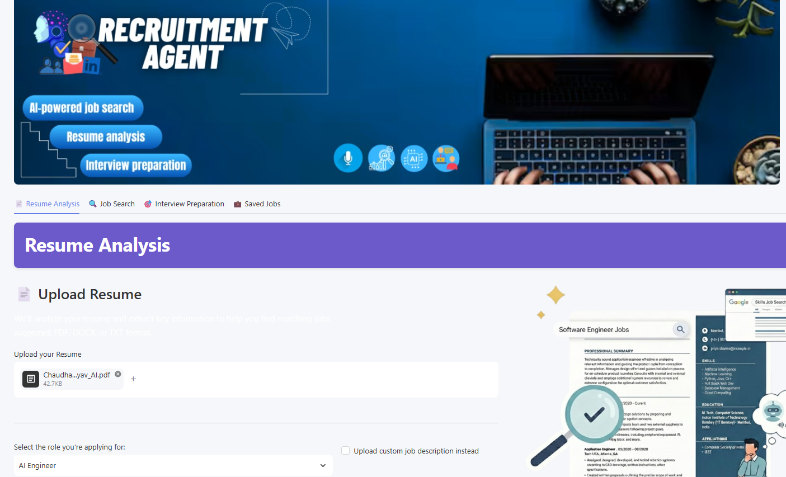
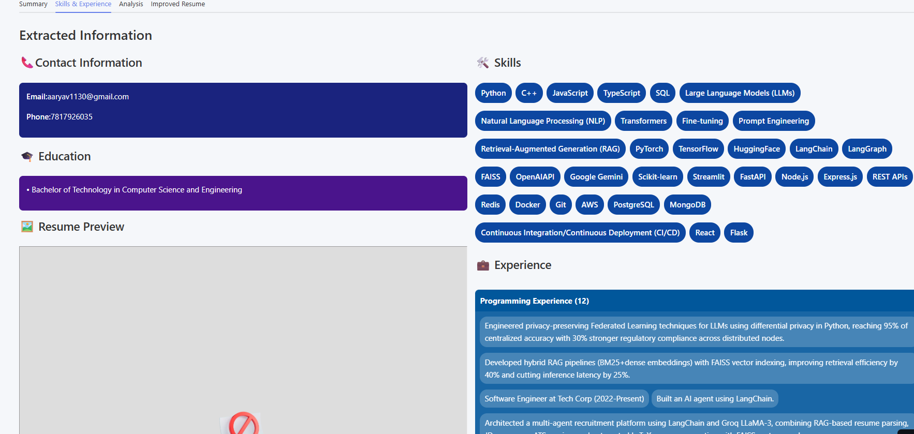
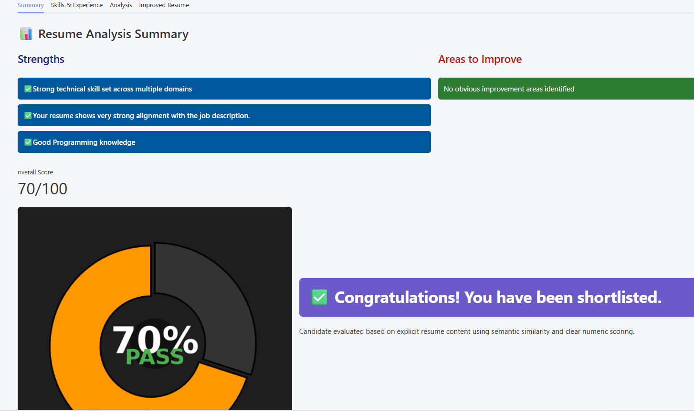
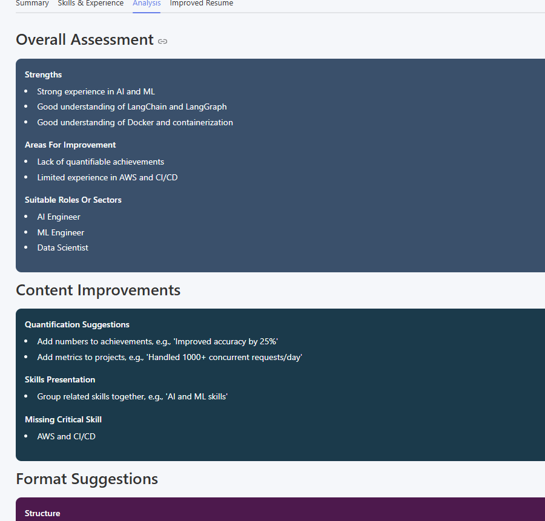
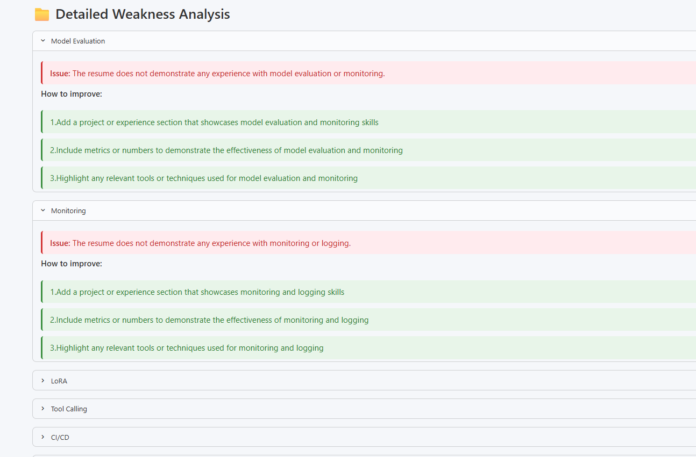
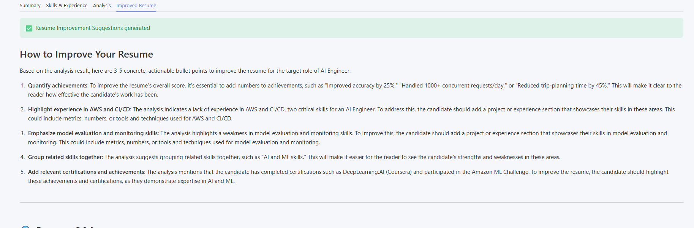
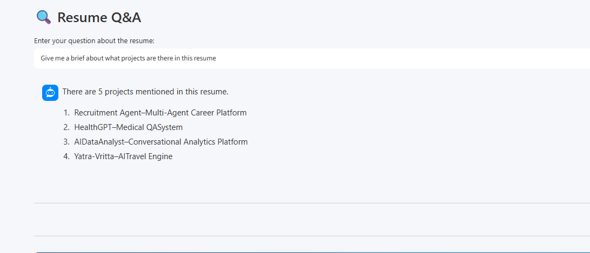
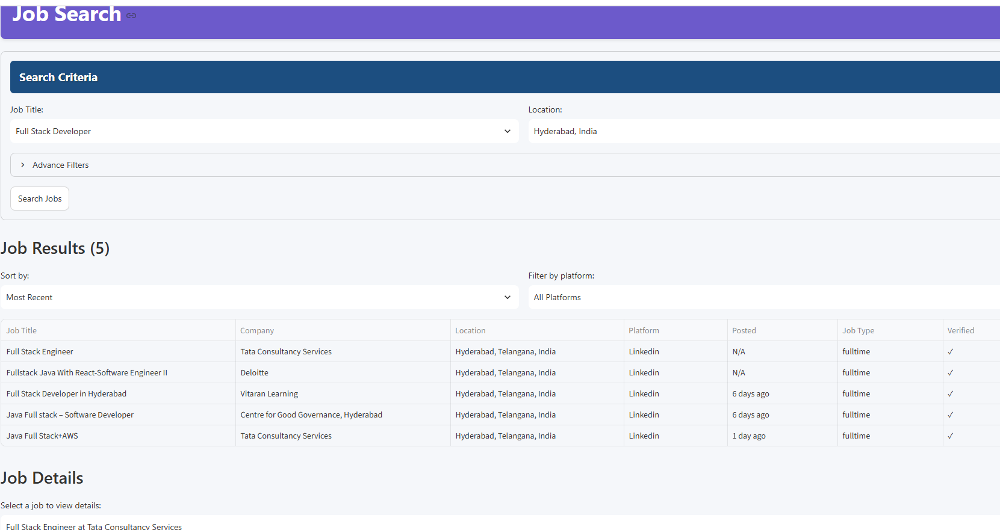

# 🤖 RecruitmentAgent – AI Career Assistant

     

An end-to-end **AI-driven recruitment automation platform** built with modular agents that handle resume analysis, intelligent job search, and adaptive live interview simulation — all in one seamless pipeline.

### 🌟 Live Demos
👉 **Main App (Resume Analysis & Job Search):** https://recruitmentagent-ijspeikrzlsn8iw7mxug5s.streamlit.app/

👉 **Live Virtual Interview Portal:** https://recruitment-agent-six.vercel.app

*(Note: The live demo relies on free-tier cloud hosting. If the app is asleep, please wait a few seconds for it to wake up!)*

---

## 📸 Platform Tour

### 1. Unified Dashboard
Upload your resume, specify the role, or provide a custom Job Description. The intuitive layout guides you through the process effortlessly.


### 2. Comprehensive Resume Extraction
Instantly parses key contact information, education, experience, and accurately extracts specialized technical skills.


### 3. Smart JD Alignment & Scoring
Leverages semantic similarity to compare your resume against real-world job requirements, generating a definitive ATS score and shortlist status.


### 4. Overall Assessment
Highlights clear strengths and flags areas needing improvement, ensuring your resume meets industry standards.


### 5. Detailed Weakness Analysis
Provides a microscopic breakdown of missing skills, with contextual advice on how to seamlessly integrate them into your experience sections.


### 6. Actionable Improvements
Delivers concrete, bulleted recommendations tailored specifically to your target role to maximize your next ATS scan.


### 7. Interactive Resume Q&A
Chat directly with your resume. Ask questions about specific projects, timelines, or skills to instantly retrieve information.


### 8. Intelligent Job Search
Seamlessly cross-references your profile with live job listings across major platforms like LinkedIn, Indeed, and Glassdoor, allowing you to filter by relevance and recency.


---

## 💡 What it does

RecruitmentAgent emulates a complete recruitment lifecycle through four autonomous components:

1. 📄 **Resume Analysis Agent** — Extracts skills/experience, performs JD-vs-resume gap analysis, generates ATS scores, and compiles an improved ATS-friendly PDF resume using LaTeX.
2. 🔍 **Job Search Agent** — Multi-tier real-time job scraping across LinkedIn, Indeed, Glassdoor, and Naukri.
3. 🎙️ **Live Interview Agent** — Real-time AI avatar interview via LiveKit + Groq STT/LLM/TTS with visual avatar integration.
4. 📊 **Interview Evaluation** — Post-interview LLM-powered scoring, Q&A breakdown, and hire/no-hire recommendation.

---

## 🛠️ Tech Stack

| Category | Technologies Used |
|----------|-------------------|
| **Frontend** | Streamlit (Main App), React 18 + Vite (Interview UI) |
| **AI & LLMs** | Groq (LLaMA-3.1-8B), LangChain |
| **Audio/Video** | LiveKit, Whisper (STT), Cartesia (TTS), Bey (AI Avatar) |
| **RAG & Search** | FAISS, HuggingFace (`all-MiniLM-L6-v2`), PyPDF2 |
| **Infrastructure** | Docker, Docker Compose, GitHub Actions (CI/CD) |
| **Database & Backend** | SQLite, SQLAlchemy, Flask |

---

## 🚀 Local Quick Start (Docker)

The easiest way to run the entire multi-service architecture locally is using Docker.

### 1. Prerequisites
- [Docker Desktop](https://www.docker.com/) installed
- API Keys for Groq and LiveKit

### 2. Configuration
Clone the repo and create your environment file:
```bash
git clone https://github.com/Aaryav1130/RecruitmentAgent.git
cd RecruitmentAgent
cp .env.example .env
```
*Edit `.env` with your `GROQ_API_KEY` and `LIVEKIT_*` credentials.*

### 3. Run the Platform
```bash
docker-compose up --build
```

This single command spins up everything:
- **Streamlit Main UI:** `http://localhost:8501`
- **React Interview Frontend:** `http://localhost:5173`
- **Flask Backend & Agents:** `http://localhost:5001`

*(Prefer running without Docker? You can still use the included `start.ps1` (Windows) or `start.sh` (Mac/Linux) scripts).*

---

## 🧪 Testing & CI/CD

The project includes a comprehensive unit test suite and automated GitHub Actions CI pipelines to ensure code quality.

```bash
# Run the test suite locally
uv run pytest tests/ -v
```

---

## 🧩 System Architecture

```text
┌─────────────────────────────────────────────────────────────────────────┐
│                        Streamlit Frontend (main.py)                     │
└──────────┬────────────────┴──────────┬──────────┴───────────┬───────────┘
           │                           │                      │
           ▼                           ▼                      ▼
┌─────────────────────┐   ┌─────────────────────┐  ┌──────────────────────────┐
│   Analysis Agent    │   │  Job Search Agent   │  │     Interview Agent      │
│                     │   │                     │  │                          │
│ • PyPDF2 parsing    │   │ • JobSpy Scraping   │  │ • LiveKit Room creation  │
│ • FAISS RAG store   │   │ • SerpAPI Fallback  │  │ • React UI (Vite+JSX)    │
│ • Groq LLaMA3 LLM   │   │                     │  │ • Groq STT + TTS         │
└─────────────────────┘   └─────────────────────┘  └──────────────────────────┘
```

---

## 📈 Recent Improvements

- ✅ **Cross-Platform Support:** Added Windows `.ps1` and Mac/Linux `.sh` startup scripts.
- ✅ **Dockerization:** Containerized all 4 services with `docker-compose`.
- ✅ **Database Migration:** Upgraded from JSON file storage to a robust SQLite database using SQLAlchemy.
- ✅ **Automated Testing:** Added a full `pytest` suite for all agents and utilities.
- ✅ **CI/CD:** Implemented GitHub Actions workflows for continuous integration.
- ✅ **UI Polish:** Added Glassmorphism effects, pulse animations, and a cohesive design system.

---

> ⭐ If you find **RecruitmentAgent** useful or interesting, please give it a star!
